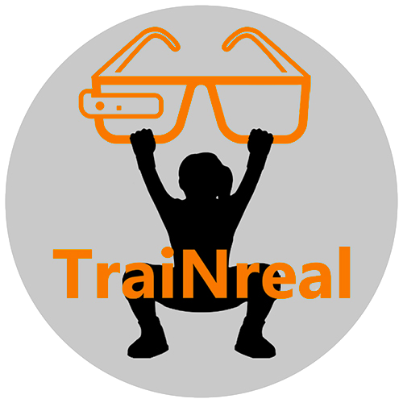
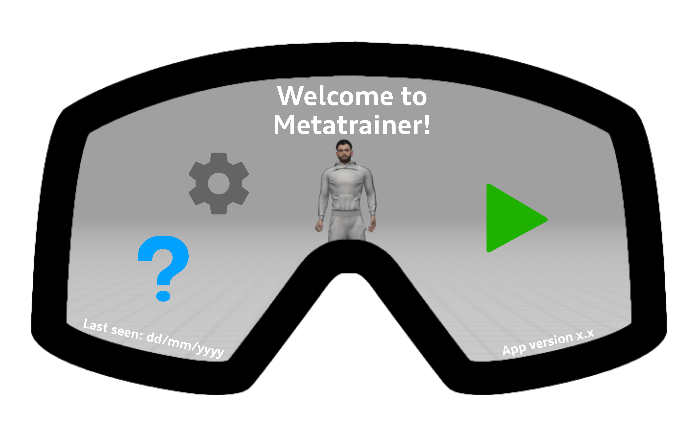
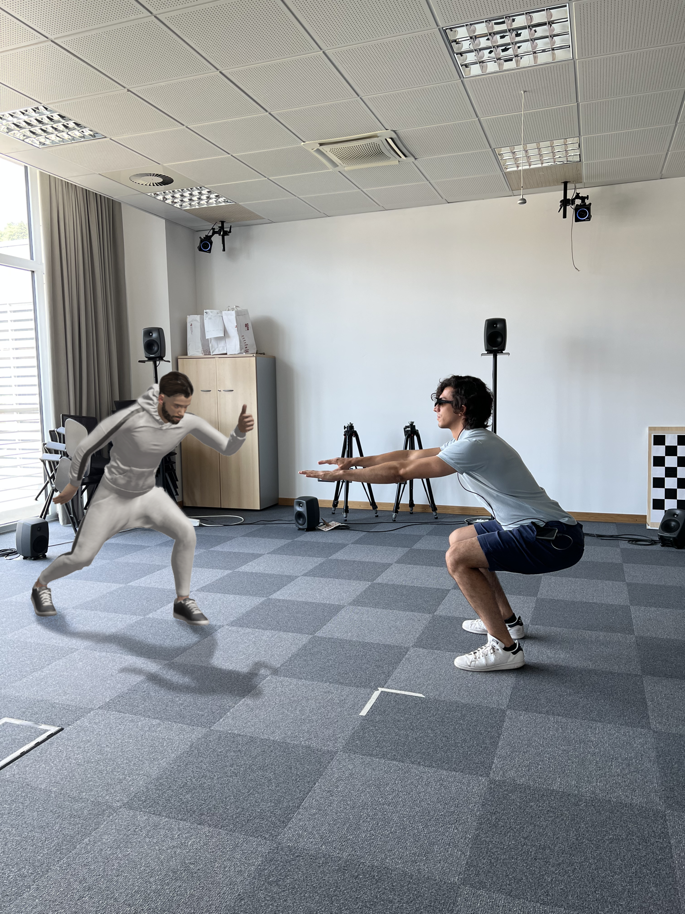
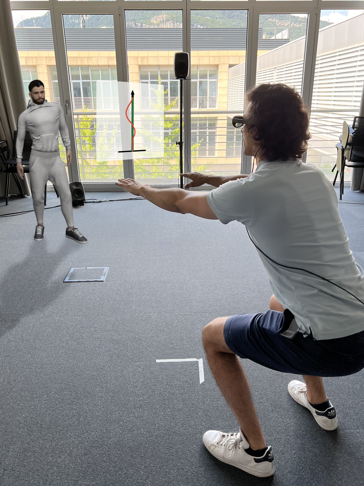
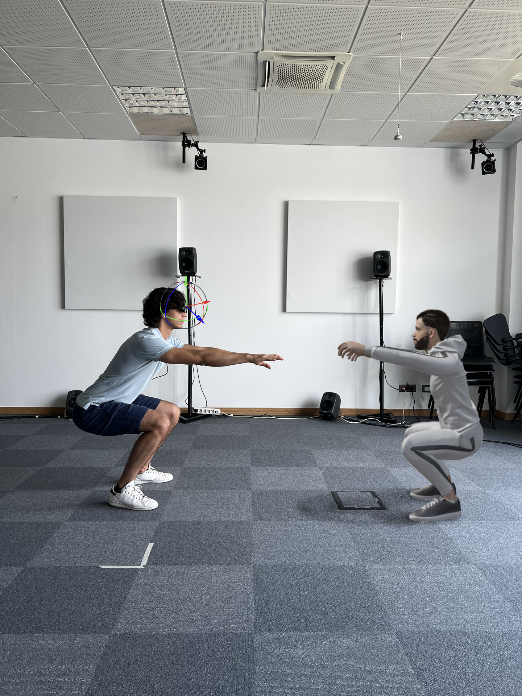
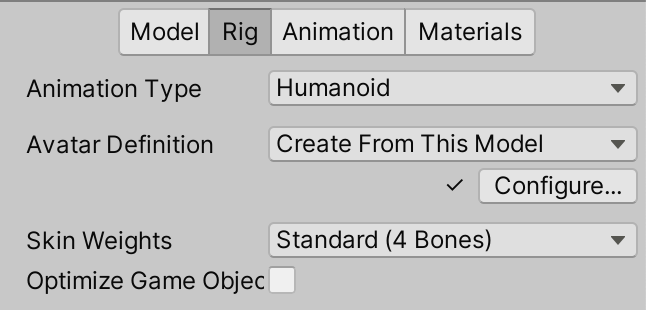
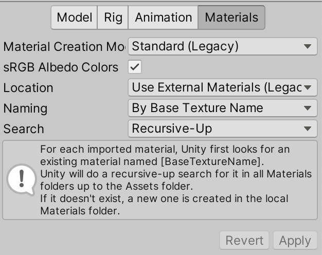
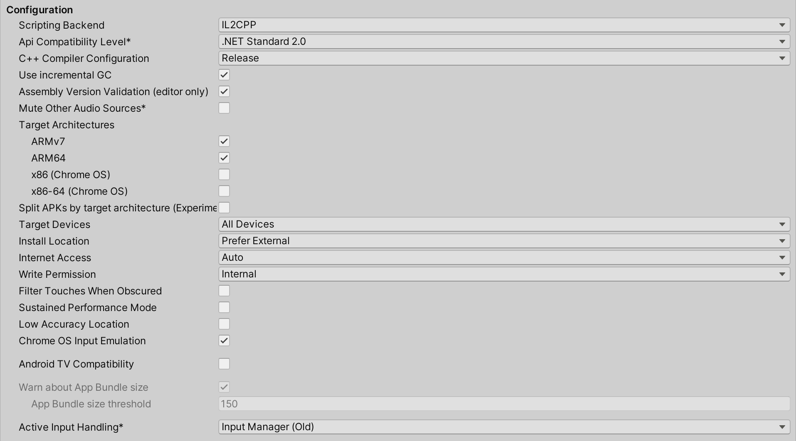

<div id="top"></div>

<!-- PROJECT LOGO -->
<br />
<div align="center">
    

  <h1 align="center">traiNreal</h1>

  <p align="center">
    A pocket-size metatrainer: fitness is only a gesture away
  </p>
</div>

> :fire: Official repository for the paper **"Meta-trainer: an augmented reality trainer for home fitness with real-time feedback"**, published at IEEE Star 2023 conference. :star2: this repo!

> :fire: Honorable mention for the Nreal AR JAM Challenge 2022


<!-- TABLE OF CONTENTS -->
<details open>
  <summary><strong>Table of Contents</strong></summary>
  
  - **[About the project :open_book:](#about-the-project-open_book)**
    - [Nreal AR JAM Challenge :rocket:](#nreal-ar-jam-challenge-2022-rocket)
    - [Workflow](#workflow)
    
  - **[Implementation :computer:](#implementation-computer)**
    - [Characters :superhero_man:](#characters-superhero_man)
    - [Animations :runner:](#animations-runner)
    - [AR implementation :goggles:](#ar-implementation-goggles)
    - [Scenes structure](#scenes-structure)
    - [Data storage :floppy_disk:](#data-storage-floppy_disk)
    
  - **[Features :sparkles:](#features-sparkles)**
    - [Gamification](#gamification)
    - [Real-time feedback](#real-time-feedback)
    - [Multi-view perspective](#multi-view-perspective)
    - [Immersivity](#immersivity)
    
  - **[Getting Started :man_technologist:](#getting-started-man_technologist)**
  - **[Usage :iphone:](#usage-iphone)**
  - **[Demo :movie_camera:](#demo-movie_camera)**
  - **[Further works](#further-works)**
  - **[Award :trophy:](#award-trophy)**
  - **[License](#license)**
  - **[Contacts](#contacts)**
  - **[Disclaimer](#disclaimer)**
  - **[Citing our work](#citing-our-work)** 
  - **[Acknowledgments](#acknowledgments)**
  
</details>


<!-- ABOUT THE PROJECT -->
## About the project :open_book:

**The project aims to create an in-door fitness application for the AR JAM Challenge 2022 proposed by Nreal.**

We were invited to join this challenge after our final submission of the *Computer Vision* project available at [github.com/laitifranz/AR-SMPLX](github.com/laitifranz/AR-SMPLX).

We had the opportunity to work with the latest AR technologies and gain knowledge and experience with Unity.
<!-- NREAL AR JAM CHALLENGE -->
### Nreal AR JAM Challenge 2022 :rocket: 
The [Nreal AR Jam](https://developer.nreal.ai/arjam/overview) is an international online challenge which was proposed in order to attract AR developers to its growing community. The competition is divided into 8 macro categories: At-Home Fitness, Art, Games, Screen 2.0, Port, Social, NFT and Student.

We decided to apply for *At-Home Fitness* category because we believe that the COVID pandemic has drastically changed our habits and many of us have taken the isolation as a chance to improve their fitness, but improvising can be ineffective or, even worse, dangerous.

We presented our idea with this incipit:

*You are at home, alone. You are not motivated. You feel pain during exercises and wonder if you are doing it correctly. Have you ever had a personal trainer in your pocket? Improve your fitness with your metatrainer, we present a revolutionary way to workout.*

Therefore, we developed an idea for helping people at home and don't feel alone during workouts.

#### Update
Official repository of IEEE Star 2023 paper "Meta-trainer: an augmented reality trainer for home fitness with real-time feedback". Presented at the International Workshop on Sport Technology and Research in Cavalese, Italy the 15th of September 2023.

<!-- WORKFLOW -->
### Workflow


The challenge was divided into 3 milestones: 
- Milestone 1: propose an idea and a pitch that describe our application.
- Milestone 2: provide concept arts (screenshots and videos of the application) and update the description.

| | |
|:-------------------------:|:-------------------------:
| |  |
  | |
<!-- https://gist.github.com/trusktr/93175b620d47827ffdedbf52433e3b37#file-image-grid-md -->
- Milestone 3: submission of the final build *traiNreal.apk* with an updated description.

<!-- IMPLEMENTATION -->
## Implementation :computer: 
In this section we will provide some information about how we obtained characters and how we implemented animations. 

We thank the YouTube channel [iHeartGameDev](https://www.youtube.com/c/iHeartGameDev) for the amazing tutorials that he made. We suggest you to see these videos to learn more about *Animation Controllers* and how to manage *Characters*, in particular [this playlist](https://www.youtube.com/playlist?list=PLwyUzJb_FNeS8s7OQKeNIr3NMHBIbhFeC).

In the source code we left references, as comments, to resources where we found how to do a certain task.

### Characters :superhero_man: 
We used two main sources for downloading our characters:
1. Mixamo from Adobe - [mixamo.com](https://www.mixamo.com/#/)
   - Settings 
      - Format: FBX for Unity 
      - Pose: T-Pose
2. Unity Asset Store - [assetstore.unity.com](https://assetstore.unity.com/)

We implemented 4 characters, available [here](Assets/Resources/Characters):
1. Adam *from Mixamo*
2. Sophie *from Mixamo*
3. Mousey *from Mixamo*
4. Space Robot Kyle *from [Unity](https://assetstore.unity.com/packages/3d/characters/robots/space-robot-kyle-4696)*

To correctly import the character, it is important to follow these steps:
1. Import the .*fbx* file inside the project
2. Open the *Inspector* of the game object
3. Set the boxes like this <br>
4. If you would like to add the default skin (it works with Mixamo characters), select *Material*, apply the settings as the image explain, and then *Apply* <br>
5. Now you should find a new prefab inside the same folder of you character!

### Animations :runner: 
We used two main sources for our animations:
1. Mixamo from Adobe - [mixamo.com](https://www.mixamo.com/#/)
   - Settings 
      - Format: FBX for Unity 
      - Skin: without skin 
      - FPS: 30 
      - Keyframe Reduction: none
2. OptiTrack systems @ Multisensory Interactions Lab UniTN - [optitrack.com](https://optitrack.com/)

We implemented several animations for our project available [here](Assets/Resources/Animations).

To properly use the animation from Mixamo, it is important to do these steps:
1. Go to your file animation that you have downloaded from Mixamo
2. Expand the object by using the arrow
3. Select the animation object (teal triangle)
4. Copy and paste the animation in another folder dedicated to animations
5. :warning: Be aware that some animations could have the *Loop Time* checkbox selected. This is essential for some animations that needs to be repeat forever
6. Create an *Animation Controller* by right-click on the [Controller folder](Assets/Resources/Animations/Controller) and choose *Create*. You need to do this because you have to create a step-by-step animations plan for you characters (see [examples](Assets/Resources/Animations/Controller) provided by us)
7. Add your sequence of animations in the *Animation Controller* ([tutorial](https://youtu.be/m8rGyoStfgQ))

### AR Implementation :goggles:
We exploit the NRSDK provided by Nreal on [developer.nreal.ai/download](https://developer.nreal.ai/download). The SDK package is already included in our project, therefore you should run it without reinstalling it.

If you would like to update the NRSDK (you can check the version of the NRSDK that we used in the [README](Assets/NRSDK/README.txt) file), follow these steps:
1. Download the new version from the official site of Nreal
2. Open your project in Unity
3. Right click on ```Assets > Import Package > Custom Package ```
4. Select the new package just downloaded
5. Apply

To use the Nreal technology, it is important to add to the scene two objects:
1. NRCameraRig
2. NRInput

We focused our attention on *NRInput*, because we needed to switch the input source type from *Controller* to *Hands*. We did it via code:
```cs
bool switchToHandTracking = NRInput.SetInputSource(InputSourceEnum.Hands);
```

### Scenes Structure
We structured our project in scenes, and we move the player across scenes during the workout.

This is the scheme of the scenes that you can find in [Assets/Scenes](Assets/Scenes):
```
.
├── Start               
│   ├── Start               # menu
│   ├── Settings            # change preferences
│   └── Helper              # briefly recap of the app and how to use it
├── Exercises             
│   ├── Warm up             # pre training warm up exercises to follow
│   ├── Main                # core exercises of our app
│       ├── Lunges          # 3D visualization of the exercise
│       ├── SquatView       # see squat movement from different viewpoints
│       └── SquatAnalysis   # real-time feedback of squat execution
│   └── Stretching          # final training exercises
└── End                     # gamification and summary moment
```

Now we will present how the scenes are connected:
```           
            Start 
              |
    ---------------------
    |         |         |
    |         |         |
Settings   Warm up    Helper   
              |
          SquatView
              |
        SquatAnalysis
              |
            Lunges
              |
         Stretching
              |
             End
              |
            Start
              |
             ... # loop
```

### Data storage :floppy_disk: 
We saved the preferences of the user using *PlayerPrefs* class (reference: [docs.unity3d.com/ScriptReference/PlayerPrefs.html](https://docs.unity3d.com/ScriptReference/PlayerPrefs.html)).

With this class we easely created different key-value data to store information like the age, the name, the volume level and so on. 

We faced reference errors while launching the app for the first time, due to the initialization of the values. To overcome it, we used the *Awake* class to set default values before the app is launched.
<!-- Features  -->
## Features :sparkles:

### Gamification
Gamification is a fundamental factor to create an engaging experience. In our version we have created the possibility to use fantasy avatars as personal trainers. Moreover, the fact of giving a final reward to the user is weighted on the quality of the exercises.

We presented the final reward as a *score*, analysing the quality of the squat. We adopted the following function:

<p align="center">
  
  
</p>

where *d* is the distance computed between the center of the circle presented in the *Squat Analysis* scene and the current position of the head. The value is collected every half second. The final score is in a range between $[0,100]$ (higher is better) and it is calculated by computing the mean between all the data collected during the squat exercise. 

We decided to adopt that function because it has a non-linear behaviour that penalizes the user's error more when it fails to stay in the green area. We empirically found the boundaries and adjusted the function for our scope.

### Real-time Feedback
We provide real-time feedbacks to the user in order to evaluate how well the athlete is performing the squat exercise. For the evaluation, we take into consideration the movement of the head as suggested in this scientific paper "[The back squat: A proposed assessment of functional deficits and technical factors that limit performance](https://www.ncbi.nlm.nih.gov/pmc/articles/PMC4262933/)". 

### Multi-view perspective
With this feature, we provide the possibility to explore the 3D exercises from all perspectives in order to help the user understand how to perform correctly the exercise. The personal trainer can be stopped in a certain position to see exactly the body pose.

### Immersivity
The trainer has to behave similar to a real human being, emulating a real workout with a personal trainer. 

We decided to use an AR experience instead of a VR one because with a VR experience the user will be detached from reality. This entails the loss of the perception of the surrounding environment. Due to this, the user may lose the orientation and the perception of the room while it is moving and performing the exercise.

<!-- GETTING STARTED -->
## Getting Started :man_technologist:

1. Install *Unity* version 2020.3 
   
   NOTE: a different version is not guaranteed to work properly
2. Clone this repository
3. Open the scene [Start](Assets/Scenes/Start/Start.unity) in Unity
4. Go to 
    ```
    File > Build Settings > choose Android Platform > switch platform
    ```
5. Go to
    ```
    File > Build Settings > Player Settings > Player 
    ```
    and check if you have the same checkboxes selected <br>
6.  Check if all the scenes mentioned above are in the scene builder
    ```
    File > Build Settings > Scenes In Build
    ```
7. Build your application and save the .apk on your computer
8.  Now you are ready to deploy the application on your device! :rocket:
9.  We used ```adb``` from the terminal to run the app on Android platform (more info available at [developer.android.com/studio/command-line/adb](https://developer.android.com/studio/command-line/adb))

If you would like to test the scene in the Unity simulator, you can do it by running the project on your local machine. You can find how to use the emulator of Nreal [here](https://nreal.gitbook.io/nrsdk/development/tools/testing-with-emulator).  

NOTE: 
- For the iOS world we are waiting for an update from Nreal to make the technology compatible with Apple devices, as mentioned by them on [Twitter](https://twitter.com/Nreal/status/1570399354745421825?ref_src=twsrc%5Etfw%7Ctwcamp%5Etweetembed%7Ctwterm%5E1570399354745421825%7Ctwgr%5E0b2e9280e1fcb86f0bfd2ff83dd765ac5bc6a591%7Ctwcon%5Es1_&ref_url=https%3A%2F%2Fd-19093620514075177499.ampproject.net%2F2210010655000%2Fframe.html)
- For the Android world, it is already possible to use the Nreal smart glasses. Please, refer to this [link](https://nreal.gitbook.io/nrsdk/frequently-asked-questions) for compatibility Android version and devices
- The application was tested on OnePlus 8T with Nreal Light - [nreal.ai/light](https://nreal.ai/light)


<!-- USAGE EXAMPLES -->
## Usage :iphone:

1. Open the application. If it is the first time that you open the app, you will be guided inside the app
2. Choose your personal trainer, among those proposed, in *Settings*
3. Start the workout and enjoy the hands-free experience
4. Enjoy your workout and do your best! :zap:


<!-- DEMO -->
## Demo :movie_camera: 
We show how the app looks like when wearing the glasses:

https://user-images.githubusercontent.com/25352428/198534659-e31fa6c2-b7e7-485e-8f64-eb700efb0656.mp4

https://user-images.githubusercontent.com/25352428/198534953-d16719c3-b85e-4b38-a20d-46f0617aaccd.mp4

https://user-images.githubusercontent.com/25352428/198534971-5e2c7738-5e83-4f43-9f2b-fcf360d10283.mp4

https://user-images.githubusercontent.com/25352428/198534994-6c8f83d4-ea6c-48c7-b55d-dfa4d694a990.mp4

https://user-images.githubusercontent.com/25352428/198535011-fa54cd89-83c3-4b80-8218-10b5ab924184.mp4

If for some reason the above section does not work, please follow these links for the demo:
| Video | Link |
| ------------ | ---- |
| Warm up init      | [Link 1](https://user-images.githubusercontent.com/25352428/198534659-e31fa6c2-b7e7-485e-8f64-eb700efb0656.mp4) |
| Warm up stop and go      | [Link 2](https://user-images.githubusercontent.com/25352428/198534953-d16719c3-b85e-4b38-a20d-46f0617aaccd.mp4) |
| Settings      | [Link 3](https://user-images.githubusercontent.com/25352428/198534971-5e2c7738-5e83-4f43-9f2b-fcf360d10283.mp4) |
| Squat analysis      | [Link 4](https://user-images.githubusercontent.com/25352428/198534994-6c8f83d4-ea6c-48c7-b55d-dfa4d694a990.mp4) |
| End scene      | [Link 5](https://user-images.githubusercontent.com/25352428/198535011-fa54cd89-83c3-4b80-8218-10b5ab924184.mp4) |


<!-- CONCLUSIONS -->
## Further works
- [ ] Add plane detection
- [ ] Improve the interface
- [ ] Support for MRTK input systems
- [ ] Create a social part inside the app
- [ ] Extend the project to more AR glasses
- [ ] Publish the app on Google Play Store

<!-- AWARD -->
## Award :trophy: 
Honorable mention by Nreal during the announcement of the final winner list! [Twitter post](https://twitter.com/nreal/status/1588154033562423298?s=46&t=8CXV-C_VtIsEePMaasjq0w)

<!-- LICENSE -->
## License

Distributed under the MIT License. See `LICENSE` for more information.

<!-- CONTACT -->
## Contacts

Francesco Laiti - [Github](https://github.com/laitifranz/) - [LinkedIn](https://www.linkedin.com/in/francesco-laiti/)
<br>
Davide Lobba - [Github](https://github.com/davidelobba/) - [LinkedIn](https://www.linkedin.com/in/davide-lobba-659739185)

## Disclaimer

The project is only for educational purposes. We don't monetize or get profit from it.

## Citing our work
If you use this code, or you find some of this repository helpful, please cite:


## Acknowledgments

We thank the team from Arcoda s.r.l & Terranova Software &  MMLab@UniTN for the active collaboration and the opportunity to use the OptiTrack system available at the Multisensory Interactions Lab.

A special thanks to Lorenzo Orlandi and Giulia Martinelli (PhD students at the University of Trento) for their support and dedication in following us during whole the project. Thanks also to Giuseppe Spallita (PhD student) for helping us with the first and third milestones of the challenge.

Background music: Mixture of NCS music from Youtube.

## Motivational quote :weight_lifting_man: 
“No man has the right to be an amateur in the matter of physical training. It is a shame for a man to grow old without seeing the beauty and strength of which his body is capable.”
<p align="right">- <i>Socrates</i> -</p>